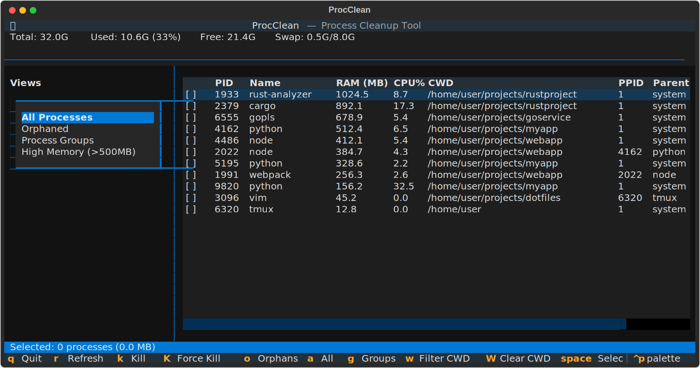
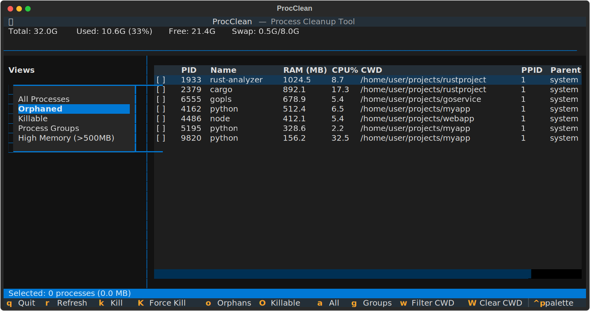
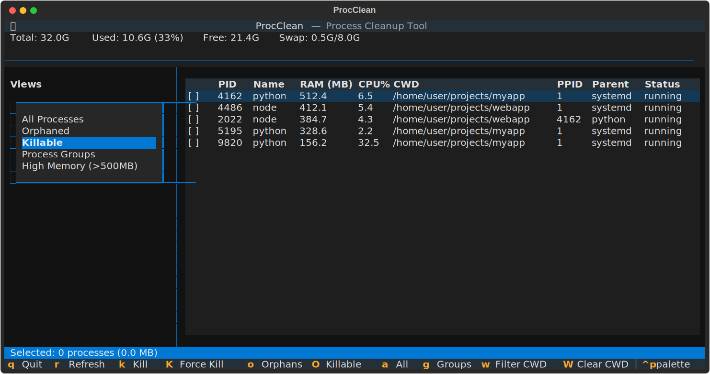
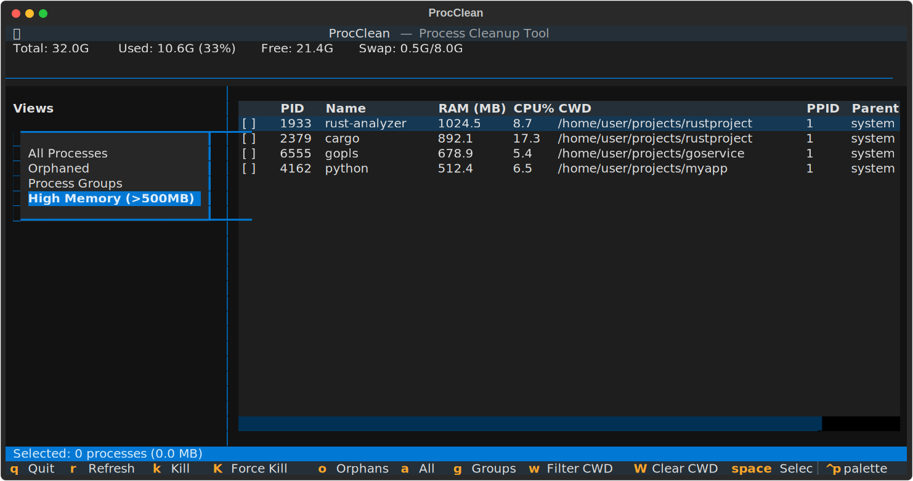
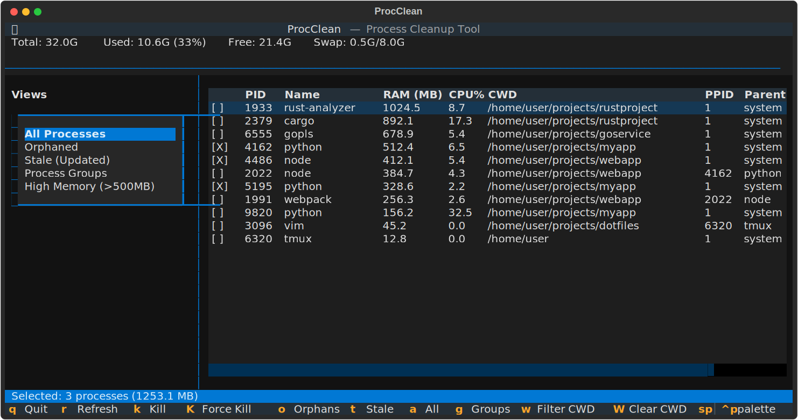

# TUI Guide

Launch the TUI with:

```bash
procclean
```



??? tip "<span id="keybindings">Keybindings</span>"

    | Key         | Action                  |
    | ----------- | ----------------------- |
    | ++q++       | Quit                    |
    | ++r++       | Refresh                 |
    | ++k++       | Kill selected (SIGTERM) |
    | ++shift+k++ | Force kill (SIGKILL)    |
    | ++o++       | Show orphans            |
    | ++a++       | Show all                |
    | ++g++       | Show groups             |
    | ++w++       | Filter by selected cwd  |
    | ++shift+w++ | Clear cwd filter        |
    | ++space++   | Toggle selection        |
    | ++s++       | Select all visible      |
    | ++c++       | Clear selection         |
    | ++1++       | Sort by memory          |
    | ++2++       | Sort by CPU             |
    | ++3++       | Sort by PID             |
    | ++4++       | Sort by name            |
    | ++5++       | Sort by cwd             |
    | ++shift+1++ | Reverse sort order      |

## Views

### All Processes

Shows all user processes sorted by memory usage.

### Orphaned

Processes with PPID=1 (parent process died). Tmux processes are excluded from
orphan detection.



### Process Groups

Similar processes grouped together - useful for finding duplicate instances
consuming resources.



### High Memory

Processes using more than 500MB RAM.



### Selection

Use ++space++ to toggle selection on processes:



## Workflow

1. Launch TUI: `procclean`
2. Press ++o++ to view orphans
3. Use ++space++ to select processes to kill
4. Press ++k++ to kill (SIGTERM) or ++shift+k++ to force kill (SIGKILL)
5. Confirm the action in the dialog
